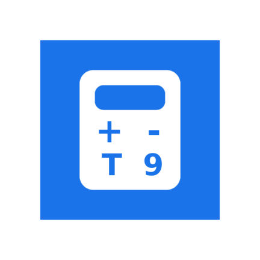

# OpenCalc

### A simple and beautiful calculator for Android devices with a physical keyboard, forked from [OpenCalc](https://github.com/Darkempire78/OpenCalc).

#

#

&nbsp;&nbsp;

## :book: Features

- Dark, Light, Amoled and Material You theme,
- Scientific mode,
- History,
- Made for devices with a physical keyboard
- More...

## 🇺🇸 Translation

Available in : 🇺🇸, 🇫🇷, 🇮🇹, 🇹🇷, 🇦🇪, 🇦🇿, 🇷🇺, 🇬🇷, 🇩🇪, 🇮🇳, 🇯🇵

## :camera: Screenshots

## :hammer: Contributing

Pull requests are welcome. For major changes, please open an issue first to discuss what you would like to change.

Please make sure to update tests as appropriate.

## :scroll: License

This project is licensed under [GPLv3](/LICENSE)
